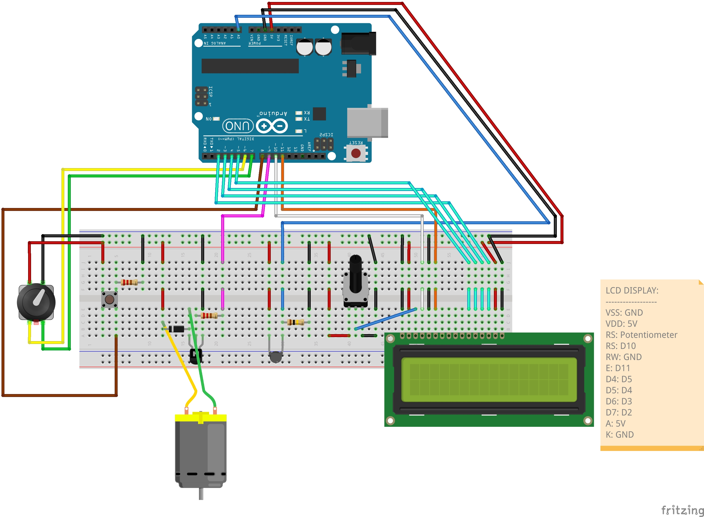
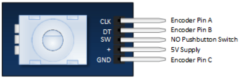
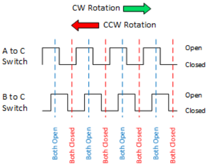
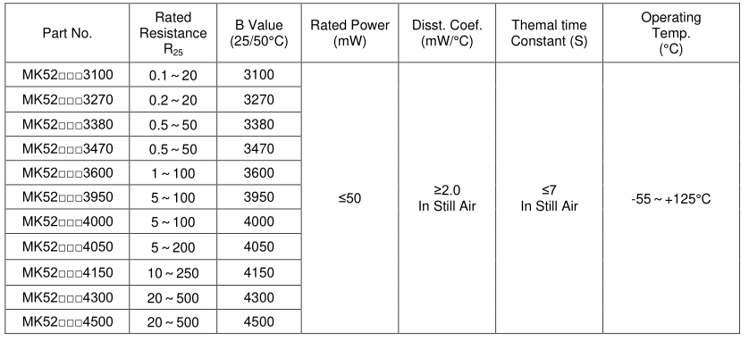
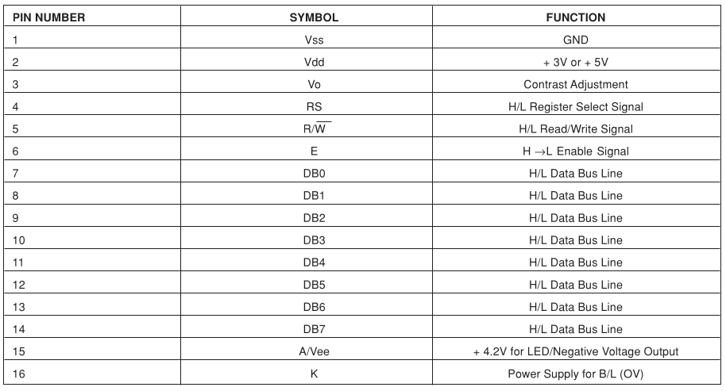
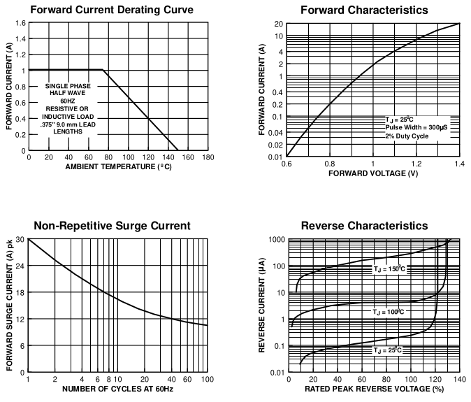
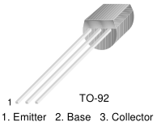

<div align="center">
   <h1>
      Automatic Temperature Control System
   </h1>
   <p align="center">
      Since <a href="https://github.com/AntonVanAssche/wittimr/issues/1">someone said</a> that 28 °C is <strong>TOO HOT</strong>, I made a automatic temperture control system.
      It measures the current temperature and turns on a fan when it rises above the desired temperature (controlled using a rotary encoder).
   </p>
</div>

## How it works


A thermistor is a variable resistor depending on the ambient temperature, therefore if we measure it's value of resistance we can determine the ambient temperature using some clever math.
First we'll have to let the Arduino measure the voltage at a point between the thermistor and a known resistor (100KΩ in my case).
If we know that <code>V<sub>out</sub> = V<sub>in</sub> * (R2 \ (R1 + R2))</code> we can rearange the equation to calculate `R2`, This will result in <code>R2 = R1 * ((V<sub>in</sub> / V<sub>out</sub>) - 1)</code>

When we know the value of `R2` we can calculate the ambient temperature with the following coefficients <code>c1 = 1.009249522e<sup>-03</sup>, c2 = 2.378405444e<sup>-04</sup>, c3 = 2.019202697e<sup>-07</sup></code>.
To calculate the ambient temperature in degree Celcius we can use: <code>T = (1.0 / (c1 + (c2 * log(R2)) + (c3 * log(R2) * log(R2) * log(R2)))) - 273.15;</code> (converting to Fahrenheit: <code>T = (T * 9.0)/ 5.0 + 32.0</code>).

Now we need a way to set/change the preferred temperature, we can do this by using a rotary encoder to increase or decrease prefered temperature.
If we rotate the knob clockwise it will increase the preferred temperature and if we rotate it counterclockwise it will decrease.

I also implemented a button to turn the system on or off. This simply shuts down the DC (Direct Current) motor.

To compile and upload the code to the Arduino you can do the following.

**NOTE**: The commands below assume you are using an Arduino UNO. Refer to the [docs](https://arduino.github.io/arduino-cli/0.27/getting-started/) for more information.

```
$ cd src/                                                                                         # Navigate inside the source directory
$ arduino-cli compile --fqbn arduino:avr:uno automatic-temperature-control-system                 # Compile the code
$ arduino-cli upload -p /dev/ttyACM0 --fqbn arduino:avr:uno automatic-temperature-control-system  # Upload the compiled code to the Arduino UNO
```

**NOTE**: don't forget to update the permissions of `/dev/ttyACM0` (`sudo chmod a+rw /dev/ttyACM0`).

## Problem(s) I encountered

Apparently you can't just type `°` to let the LCD display print out the degree symbol, but you have to type `(char)223` (ASCII Code).

The DC motor was drawing too much current, this was causing the Arduino to constantly shut down and restart.
I've fixed it by powering the DC motor using a separate powersource.
Man I need a multimeter for these things.

## Electrical scheme



| Rotary Encoder Pin Connections      | Rotary Encoder Characteristics   |
| ----------------------------------- | -------------------------------- |
|  |  |

| Thermistor Characteristics |
| -------------------------- |
|  |

| LCD Pin Connections |
| ------------------- |
|  |

| 1N4007 Characteristics |
| ---------------------- |
|  |

| PN2222 Pin Connections |
| ---------------------- |
|  |
